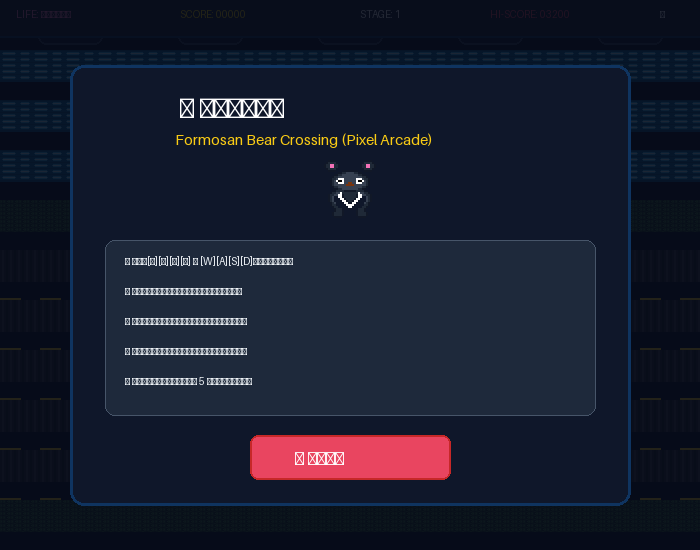
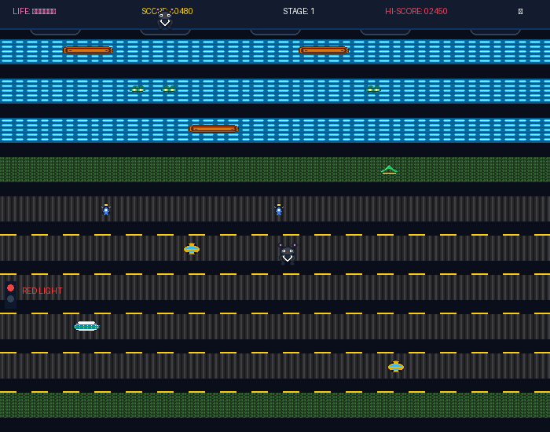
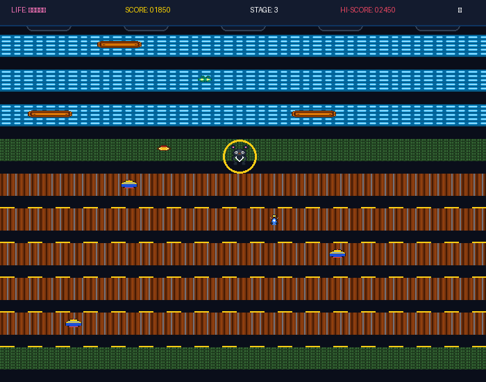
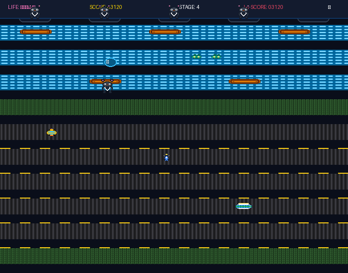

# 🐻 Formosan Bear Crossing | 台灣黑熊過街 (Pixel Arcade)

<p align="center">
  <a href="./README.md"><b>繁體中文</b></a> |
  <a href="./README.en.md"><b>English</b></a> |
  <a href="./README.ja.md"><b>日本語</b></a>
</p>

> A 2D retro arcade web game featuring Taiwan's iconic endemic subspecies, the **Formosan Black Bear** (*Ursus thibetanus formosanus*).  
> Developed using **OpenSpec** spec-driven methodology with pure native HTML5 Canvas 2D rendering and zero external asset dependencies.

🎮 **[Play Online Now (GitHub Pages)](https://tonnychiulab.github.io/bear-crossing/)**

---

## 🎮 Game Features

- 🐻 **Iconic Formosan Black Bear**: High-contrast 32×32 pixel art faithfully showcasing the signature white "V" chest mark, thick round ears, and hop/idle/spin-death animations.
- 🛵 **Authentic Taiwanese Vehicles**: Blue-and-white scooters, yellow taxis, classic green-and-white city buses, and iconic yellow-and-blue municipal garbage trucks.
- 🗺️ **Four Cyclic Themed Stages**:
  1. **Urban Street (市區道路)**: Dense scooter cascades, yellow cabs, and traffic light vehicle-stopping controls.
  2. **Highway Express (高速公路)**: High-speed buses and sedans with wide gaps demanding razor-sharp timing.
  3. **Mountain Trail (山區道路)**: Winding gravel roads with garbage trucks, dirt paths, and mountain streams.
  4. **River Rapids (秀姑巒溪)**: Fast-flowing currents, drifting logs, and **turtles with timed diving mechanics**.
- 🎋 **Power-ups & Dynamic Hazards**:
  - **Bamboo Shoot (竹筍)**: Short-term agility boost cutting hop delays in half.
  - **Honey Jar (蜂蜜罐)**: Golden honeycomb shield absorbing one fatal vehicle collision or river rescue.
  - **Traffic Lights (紅綠燈)**: Cyclically turns red in urban lanes, bringing traffic to a complete halt.
  - **Diving Turtles (烏龜潛水)**: Turtle pods bubble and submerge periodically; stepping on submerged turtles results in drowning.
- 🎵 **8-Bit Procedural Audio Engine**: Real-time synthesized sound effects and 4 scene-specific Chiptune background music loops via the W3C Web Audio API with zero external audio files. Includes a one-click mute toggle (`🔊/🔇`).
- 📋 **One-Click Score Sharing**: Copy formatted emoji score cards directly to the clipboard from the game over screen.

---

## 📸 In-Game Screenshots

| Start Screen & Guide | Urban Street Stage |
| :---: | :---: |
|  |  |
| *Retro arcade modal & 64px pixel bear showcase* | *Scooter swarm, yellow cabs & traffic light control* |

| Mountain Trail Stage | River Rapids Stage |
| :---: | :---: |
|  |  |
| *Gravel roads, garbage trucks & honey shield ring* | *Rapids, floating logs & periodic turtle diving* |

---

## 🕹️ Controls

| Key / Action | Function |
| :--- | :--- |
| <kbd>↑</kbd> <kbd>↓</kbd> <kbd>←</kbd> <kbd>→</kbd> or <kbd>W</kbd> <kbd>A</kbd> <kbd>S</kbd> <kbd>D</kbd> | Move Formosan Black Bear across grid cells |
| <kbd>Space</kbd> or <kbd>Enter</kbd> | Start Game / Next Level / Restart |
| 📱 **Mobile Touch** | Touch swipe gestures & on-screen virtual directional buttons (D-pad) |
| 🔊 / 🔇 Button | Toggle audio on/off anytime from the top-right HUD |

---

## 🏗️ Technical Architecture

This project is built on a **pure static architecture** with zero build steps or bundler dependencies, allowing it to run offline simply by double-clicking:

```text
bear-crossing/
├── index.html              # Game container, HUD, and Canvas viewport
├── index.mvp.html          # Heritage DOM + SVG MVP backup
├── css/
│   └── style.css           # Arcade CRT aesthetic & responsive container
└── js/
    ├── audio.js            # Web Audio API 8-bit sound synth & Chiptune sequencer
    ├── sprites.js          # Palette-based string matrix pixel art generator
    ├── tilemap.js          # 4-theme tile rendering, lane configurations & traffic lights
    ├── entities.js         # Player bear, vehicles, river entities, and power-up collisions
    └── game.js             # 60FPS state machine loop, high scores & clipboard sharing
```

---

## 📄 Development Methodology: OpenSpec

This project was developed strictly adhering to **[OpenSpec](https://github.com/Fission-AI/OpenSpec)** (Spec-Driven Development):
- Full change specification artifacts can be viewed in [`openspec/changes/bear-crossing-canvas-upgrade/`](./openspec/changes/bear-crossing-canvas-upgrade/):
  - `proposal.md`: Motivation, breaking changes, and capability scope.
  - `specs/`: Behavioral contracts for Canvas Engine, Gameplay Mechanics, and Audio System.
  - `design.md`: Technical decisions (In-Memory Canvas caching, procedural generation, and tradeoffs).
  - `tasks.md`: Trackable checklist with 17 verified tasks.

---

## 🛠️ AI Skills & Workflows Employed

During this upgrade, specialized AI Agent skills were leveraged to align design decisions and verify delivery:

1. **`/grill-me` (Antigravity Interactive Alignment)**  
   - Interviewed through the decision tree to define the "Medium Upgrade ⭐⭐⭐" scope, finalizing 32×32 pixel art, procedural generation, multi-stage progression, and zero-dependency static execution.
2. **`openspec-propose` (OpenSpec Proposal Generation)**  
   - Generated standardized OpenSpec artifacts (Proposal, Delta Specs, Technical Design, and 17 grouped tasks) in one pass based on the agreed design.
3. **`openspec-apply-change` (OpenSpec Task Execution)**  
   - Iteratively implemented styling, sprite generation, tilemap, entities, and audio modules against the task checklist with 100% verification.

---

## 🤖 Hybrid Multi-Model Collaboration

This project demonstrates an innovative **Hybrid AI Multi-Model Pairing** strategy, dynamically switching between specialized LLMs to match the characteristics of each development phase:

| Phase | Model | Primary Contribution |
| :--- | :--- | :--- |
| **Phase 1: Architecture Alignment & Deep Reasoning** | **Claude Opus 4.6 (Thinking)** | **Deep Architectural Deduction**: Led the `/grill-me` interactive interview, exploring decision tree branches from visual fidelity to river dive mechanics to delineate the precise project boundary. |
| **Phase 2: Spec Formulation & High-Speed Execution** | **Gemini 3.8 Flash (Medium)** | **Agile Specs & Engineering Delivery**: Formulated OpenSpec artifacts and implemented all 5 modular JavaScript components (Canvas 2D, matrix sprites, Web Audio) with automated Git & GitHub Pages deployment. |

---

## 🎨 Asset & Source Declarations

In accordance with our "100% Procedural Generation & Zero Third-Party Asset Dependency" principle:

1. **Pixel Art Sprites**:
   - **Formosan Black Bear & Vehicles**: Rendered dynamically in memory using original **Palette-based String Matrices** in [`js/sprites.js`](./js/sprites.js). No external sprite sheets or unlicensed graphics used.
   - **Cultural Inspiration**: Faithfully reflects Taiwan's endemic subspecies (*Ursus thibetanus formosanus*) with its signature white "V" chest mark, paired with authentic local vehicles (SYM/Kymco style scooters, yellow cabs, green-white city buses, municipal garbage trucks).
2. **Audio & Soundtracks**:
   - **100% Procedural Synthesis**: Synthesized on-the-fly via W3C standard **Web Audio API** (`OscillatorNode`, `GainNode`, and `BiquadFilterNode`) in [`js/audio.js`](./js/audio.js). No external MP3, WAV, or sound libraries used.
3. **Gameplay Heritage & Inspiration**:
   - **Arcade Homage**: Inspired by the classic grid-crossing and river mechanics of *Frogger* (Konami, 1981), infused with Taiwanese urban geography and nature.
   - **First-Gen Heritage**: The original DOM + SVG + Emoji MVP is preserved in [`index.mvp.html`](./index.mvp.html).

---

## 👥 Co-Authors & Team

- **Tonny Chiu** ([@tonnychiulab](https://github.com/tonnychiulab))  
  *Project Initiator, Product Direction, Gameplay Design & Quality Assurance*
- **Antigravity** (Google DeepMind Advanced Agentic Assistant)  
  *AI Pair Programmer (Hybrid Multi-Model Collaboration)*
  - 🧠 **Claude Opus 4.6 (Thinking)**: Architectural deduction & `/grill-me` alignment
  - ⚡ **Gemini 3.8 Flash (Medium)**: OpenSpec generation, full-stack implementation & deployment

---

## 🚀 License

Released under the [MIT License](./LICENSE). Feel free to fork, customize, and beat the high score!
